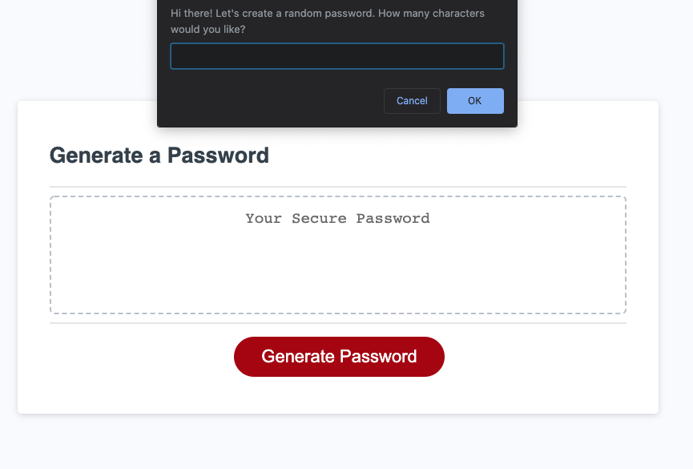
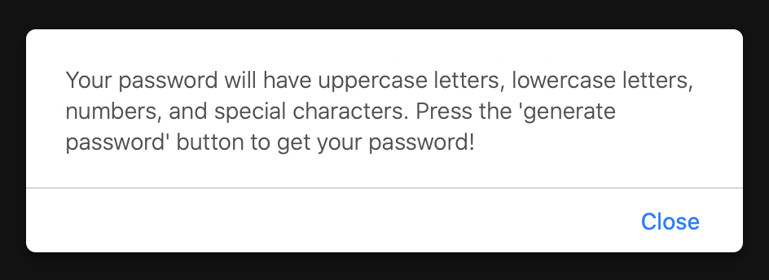
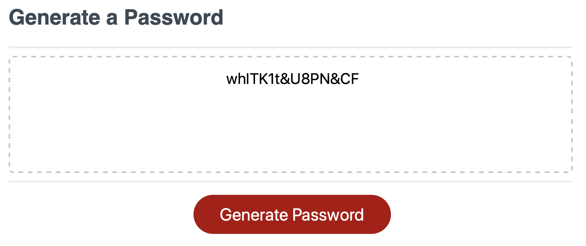

# The Password Generator
https://kreidanderson.github.io/pw_gen/

## Goals
- To give the user a fast way of creating a new password
- Giving the user the ability to choose from uppercase letters, lowercase letters, numbers, and special characters

## Design Process
- I began this project by writing out the prompts that needed to be alerts within the browser
- After that, I found all the possible combinations of the four variables (uppercase, lowercase, numbers, and special characters)
- From there I had to make sure that when certain buttons were pressed, they would actually perform what they're being asked/called to do.
- Eventually I was able to close all the right brackets and parentheses for the code to work - It is definitely not the cleanest code but it does exactly what it's supposed to do for the user!

## Technology Used
- Javascript

## Example Result:

